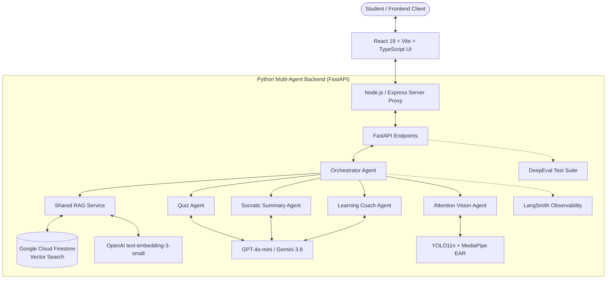

<div align="center">

# 🦉 Attocus (أتـوكـس)
### Intelligent Multi-Agent Socratic Study Companion & Cognitive Focus Platform

[](https://fastapi.tiangolo.com)
[](https://react.dev)
[](https://www.typescriptlang.org)
[](https://openai.com)
[](https://ai.google.dev)
[](https://firebase.google.com)
[](https://smith.langchain.com)
[](https://confident-ai.com)

<p align="center">
  <b>Attocus</b> is a next-generation AI study room designed to elevate deep comprehension, active recall, and sustained attention. Powered by an orchestrated multi-agent network, native Cloud Firestore Vector Search (RAG), and real-time computer vision attention telemetry.
</p>

</div>

---

## 🌟 Key Features | أهم المميزات

### 1. 🧠 Multi-Agent Socratic Architecture (منظومة الوكلاء الأذكياء)
- **🎯 Orchestrator Agent (`OrchestratorAgent`)**: The central brain managing real-time student telemetry, cognitive fatigue, agent delegation, and session persistence.
- **💬 Socratic Summary Agent (`SocraticSummaryAgent`)**: Conducts multi-turn Socratic questioning to assess authentic understanding, handles "I don't know" moments with scaffolded hints, and compiles unified summaries in the student's own words.
- **📝 Retention & Quiz Agent (`QuizAgent`)**: Automatically formulates grounded True/False and 4-option multiple-choice quizzes strictly anchored in retrieved lecture chunks (zero hallucinations or superficial questions).
- **💡 Adaptive Learning Coach (`LearningCoachAgent`)**: Diagnoses student misconceptions in real-time, adjusts explanation depth (analogies, technical proofs, real-world examples), and identifies knowledge gaps.
- **👁️ Vision & Distraction Agent (`AttentionAgent`)**: Edge computer vision tracking distraction (YOLO11n phone detection) and drowsiness (MediaPipe FaceMesh Eye Aspect Ratio) with gentle intervention alerts.

### 2. ⚡ Shared Vector RAG Engine (محرك الاسترجاع الشعاعي المشترك)
- **Cloud Firestore Vector Search**: Native vector search using Firestore `find_nearest` with `COSINE` distance metric and in-memory similarity fallback.
- **Multi-Format Ingestion**: Supports high-res PDF rendering & parsing alongside PowerPoint (`.pptx`) XML slide decomposition.
- **Semantic Chunking**: Powered by `RecursiveCharacterTextSplitter` and embedded via OpenAI `text-embedding-3-small` (1536 dimensions).

### 3. 🛡️ Enterprise Evaluation & Observability (المراقبة والتقييم الآلي)
- **LangSmith Tracing**: Full real-time observability across all agent execution chains, token consumption, and latency graphs (`@traceable_agent`).
- **DeepEval CI/CD Validation**: Automated evaluation suite testing `Faithfulness` (hallucination prevention), `AnswerRelevancy`, and `ContextualRelevancy`.

### 4. 🎨 Modern Interactive Study Room (غرفة المذاكرة التفاعلية)
- Ultra-sharp slide presentation canvas with high-DPI rendering and annotation tools.
- Integrated Pomodoro focus timer with gamified focus points.
- Instant concept explanations drawer and end-of-session knowledge gap heatmaps.

---

## 🏗️ System Architecture | هيكلية النظام



---

## 📁 Repository Structure | هيكل المستودع

```text
attocus/
├── backend/                        # Python FastAPI Multi-Agent AI Backend
│   ├── agents/                     # Specialized AI Agents
│   │   ├── orchestrator.py         # Central Orchestrator & Session Coordinator
│   │   ├── quiz_agent.py           # Grounded Quiz & Retention Assessment Agent
│   │   ├── summary_agent.py        # Socratic Dialogue & Active Recall Agent
│   │   ├── learning_agent.py       # Concept Explainer & Misconception Coach
│   │   └── attention_agent.py      # Fatigue, Phone & Distraction Telemetry Agent
│   ├── routers/
│   │   └── detection.py            # WebSocket YOLO11n + MediaPipe Vision Router
│   ├── services/
│   │   ├── observability.py        # LangSmith Tracing & Client Wrappers
│   │   └── eval_service.py         # DeepEval Metrics (Faithfulness, Relevancy)
│   ├── tests/
│   │   └── test_eval.py            # Automated Pytest Evaluation Suite
│   ├── models/                     # Vision weights (yolo11n.pt)
│   ├── rag_service.py              # Firestore Vector RAG & PDF/PPTX Parser
│   ├── main.py                     # FastAPI Application & API Routes
│   └── requirements.txt            # Complete Python Dependencies
│
├── src/                            # Frontend (React 19 + TypeScript + Vite)
│   ├── components/                 # UI Modals, Canvas, Study Room & Sidebar
│   │   ├── StudyRoomView.tsx       # Main Lecture & Study Room Experience
│   │   ├── UploadModal.tsx         # Lecture Upload with Automatic RAG Sync
│   │   ├── QuickQuizModal.tsx      # RAG-Grounded Slide Quiz Modal
│   │   ├── UnderstandingModal.tsx  # Socratic Dialogue Modal
│   │   ├── ExplainDrawer.tsx       # Real-time Concept Explainer Drawer
│   │   ├── PomodoroTimer.tsx       # Focus Timer & Productivity Tracker
│   │   └── SlideViewer.tsx         # High-DPI Slide Viewer & Annotator
│   ├── utils/                      # PDF parsing & text extraction utilities
│   ├── types.ts                    # Strongly Typed Data Models & Interfaces
│   └── App.tsx                     # Main Application Entrypoint
│
├── public/                         # Static Assets & pdf.worker.min.mjs
├── server.ts                       # Node.js API Proxy Server
├── package.json                    # Frontend Dependencies & Scripts
└── .env.example                    # Environment Template Configuration
```

---

## 🚀 Getting Started | طريقة التشغيل

### 1. Prerequisites (المتطلبات الأساسية)
- **Node.js**: v18.0 or higher
- **Python**: v3.9 or higher
- **Git**

---

### 2. Backend Setup (تهيئة الواجهة الخلفية)

1. Navigate to the backend directory:
   ```bash
   cd backend
   ```

2. Create and activate a Python virtual environment:
   ```bash
   python3 -m venv .venv
   source .venv/bin/activate       # On macOS / Linux
   # .venv\Scripts\activate      # On Windows
   ```

3. Install all dependencies from `requirements.txt`:
   ```bash
   pip install -r requirements.txt
   ```

4. Configure environment variables:
   ```bash
   cp .env.example .env
   ```
   Edit `.env` and fill in your keys:
   ```env
   OPENAI_API_KEY="sk-..."
   GEMINI_API_KEY="..."
   FIREBASE_SERVICE_ACCOUNT_KEY="serviceAccountKey.json"  # Optional: for Cloud Firestore
   LANGCHAIN_TRACING_V2="true"                          # Optional: for LangSmith
   LANGCHAIN_API_KEY="lsv2_pt_..."
   LANGCHAIN_PROJECT="Attocus-Platform"
   ```

5. Start the FastAPI backend server:
   ```bash
   uvicorn main:app --host 127.0.0.1 --port 8000 --reload
   ```
   The backend will be live at `http://127.0.0.1:8000` (API Docs: `http://127.0.0.1:8000/docs`).

---

### 3. Frontend Setup (تهيئة واجهة المستخدم)

1. Return to the root directory:
   ```bash
   cd ..
   ```

2. Install Node dependencies:
   ```bash
   npm install
   ```

3. Configure your frontend `.env`:
   ```bash
   cp .env.example .env
   ```

4. Start the development server:
   ```bash
   npm run dev
   ```
   Open your browser at `http://localhost:3000`.

---

## 🧪 Running Automated Tests (فحص واختبار المنظومة)

### 1. Frontend TypeScript Validation
```bash
npm run lint
```

### 2. Python Static Typing Check
```bash
cd backend
.venv/bin/pyright rag_service.py agents/quiz_agent.py agents/summary_agent.py
```

### 3. DeepEval Evaluation & Groundedness Tests
```bash
cd backend
pytest tests/test_eval.py -v
```
Verifies that:
- Quiz generation has 100% groundedness against lecture slides.
- Learning coach explanations maintain strict faithfulness to RAG source material without hallucinations.

---

## 🔑 Firebase Cloud Firestore Vector Setup (إعداد فايربيس)

1. In your Firebase Console, open **Project Settings** -> **Service Accounts**.
2. Click **Generate New Private Key** to download your credentials JSON file.
3. Place the file inside `backend/` as `serviceAccountKey.json` (it is automatically ignored by `.gitignore`).
4. In Firestore, create the collection `pdf_embeddings` or let Attocus auto-initialize it.
5. In Cloud Firestore, vector queries utilize native vector indexing with `COSINE` distance.

---

## 👥 Contributors | المساهمون

- **Sukainah Alramadhan** ([@sukainahAlramadhan](https://github.com/sukainahAlramadhan))
- **Bariqa aljarallah** ([@Bariqa1](https://github.com/Bariqa1))
- **Rana Alosaimi** ([@Rana-21](https://github.com/Rana-21))
- **Taif Alanzi** ([@taifl2](https://github.com/taifl2))
---

<div align="center">
  <sub>Built with ❤️ for empowered learning, sustained cognitive focus, and academic excellence.</sub>
</div>
