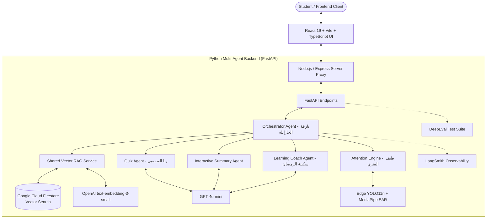

<div align="center">
  
# 🦉 Attocus (أتـوكـس)
### Intelligent Multi-Agent Interactive Study Companion & Cognitive Focus Platform
**Flagship Graduate Project · Saudi Digital Academy (SDA Agentic AI Bootcamp)**

[](https://fastapi.tiangolo.com)
[](https://react.dev)
[](https://www.typescriptlang.org)
[](https://openai.com)
[](https://firebase.google.com)
[](https://smith.langchain.com)
[](https://confident-ai.com)

<p align="center">
  <b>Attocus</b> is an intelligent, privacy-first study room designed to turn passive reading into deep mastery, active recall, and sustained attention. Powered by an orchestrated network of 4 specialized AI agents, native Cloud Firestore Vector Search (RAG), and client-side on-device computer vision attention telemetry.
</p>

</div>

---

## 🇸🇦 SDA Agentic AI Bootcamp Accreditation | اعتماد معسكر الأكاديمية السعودية الرقمية

تم بناء وتطوير منصة **Attocus** كأحد مشاريع التخرج المتميزة ضمن **معسكر الذكاء الاصطناعي للوكلاء الأذكياء (SDA Agentic AI Bootcamp)** المقدم من **الأكاديمية السعودية الرقمية (Saudi Digital Academy)**، بتعاون تكاملي كامل بين مهندسات فريق التأسيس عبر أحدث معايير هندسة الأنظمة الذكية متعددة الوكلاء (Multi-Agent Systems).

---

## 🌟 Key Features | أهم المميزات

### 1. 🧠 Multi-Agent Architecture (منظومة الوكلاء الأذكياء)
- **🎯 Orchestrator Agent (`OrchestratorAgent`)**: العقل المنسق لإدارة تدفق الجلسة، تفويض المهام المعرفية، وتنسيق استجابات الوكلاء في الوقت الحقيقي.
- **💬 Interactive Summary Agent (`SummaryAgent`)**: يقود حواراً تفاعلياً يقيس الاستيعاب الحقيقي للدرس، ويجمع الملخص المكتوب بأسلوب الطالب الخاص لترسيخ الذاكرة بعيدة المدى.
- **📝 Retention & Quiz Agent (`QuizAgent`)**: يولد تلقائياً أسئلة صح/خطأ واختيار من متعدد مرتبطة بشكل موثق بشرائح المحاضرة (Strict Grounding بدون أي هلوسة).
- **💡 Adaptive Learning Coach (`LearningCoachAgent`)**: يشخص المفاهيم الخاطئة لدى الطالب، ويقدم شروحاً تفاعلية تكيفية وتشبيهات تبسيطية متدرجة.
- **👁️ Attention & Distraction Agent (`AttentionAgent`)**: رصد فوري للتركيز والتشتت بالهاتف وإغلاق العينين (YOLO11n + MediaPipe FaceMesh) معالجة 100% على جهاز الطالب وبخصوصية تامة.

### 2. ⚡ Shared Vector RAG Engine (محرك الاسترجاع الشعاعي المشترك)
- **Cloud Firestore Vector Search**: بحث شعاعي مباشر باستخدام `find_nearest` مع مقياس جيب التمام `COSINE` مع فولباك محلي ذكي.
- **Multi-Format Ingestion**: دعم عالي الدقة لتحليل وتقطيع ملفات الـ PDF وعروض البوربوينت (`.pptx`).
- **Semantic Chunking**: تقطيع معرفي ذكي مدمج عبر OpenAI `text-embedding-3-small` (1536 أبعاد).

### 3. 🛡️ Enterprise Evaluation & Observability (المراقبة والتقييم الآلي)
- **LangSmith Tracing**: مراقبة حية لجميع سلاسل التنفيذ، استهلاك التوكنز، ومعدل الاستجابة (`@traceable_agent`).
- **DeepEval CI/CD Validation**: 72 فحصاً مؤتمتاً لضمان الموثوقية (`Faithfulness`)، دقة الإجابات، وخلو المخرجات من الهلوسة.

### 4. 🎨 Modern Interactive Study Room (غرفة المذاكرة التفاعلية)
- كانفاس رسم وملاحظات تفاعلي عالي الدقة (High-DPI Canvas Engine) مستوحى من Notability بدون أي تشويه للخطوط.
- مؤقت بومودورو ذكي مع نظام مكافآت ونقاط تركيز ومتجر لفتح الشخصيات.
- ثنائية لغوية كاملة (العربية والإنجليزية) مع دعم فوري للوضعين الفاتح والداكن.

---

## 🏗️ System Architecture | هيكلية النظام



---

## 👥 Co-Founders & Core Engineering Team | فريق التأسيس

جميع أعضاء الفريق يحملن مسمى **مؤسسة مشاركة ومهندسة ذكاء اصطناعي للوكلاء (Co-Founder & Agentic AI Engineer)**، وقد ساهمن جماعياً في بناء واجهات المنصة وبنيتها التفاعلية، مع تخصص كل مؤسسة في الركائز التالية:

| الاسم (Name) | التخصص الأكاديمي (Academic Background) | الركيزة والمسؤولية التقنية (Technical Core) | حساب LinkedIn الرسمي |
| :--- | :--- | :--- | :--- |
| **طيف العنزي**<br>(Taif Alanzi) | نظم معلومات<br>(Information Systems) | • هندسة منظومة تتبع التركيز (Attention Tracking Engine)<br>• تصميم وتكامل قواعد البيانات (Databases Architecture)<br>• المساهمة في بناء الواجهات التفاعلية وتجربة المستخدم | [LinkedIn Profile](http://www.linkedin.com/in/taif-alanzi-is) |
| **بارقة الجارالله**<br>(Bariqa Aljarallah) | علوم حاسب<br>(Computer Science) | • هندسة وكيل التنسيق الرئيسي (Orchestrator Agent)<br>• تصميم وتكامل قواعد البيانات (Databases Architecture)<br>• المساهمة في بناء الواجهات التفاعلية والعمل التكاملي | [LinkedIn Profile](https://www.linkedin.com/in/bariqa-aljarallah?utm_source=share_via&utm_content=profile&utm_medium=member_ios) |
| **سكينة الرمضان**<br>(Sukainah Alramadhan) | ذكاء اصطناعي<br>(Artificial Intelligence) | • هندسة وكيل التعلم والشرح التفاعلي (Learning Coach Agent)<br>• صياغة النماذج التوجيهية والاستيعاب التكيفي<br>• المساهمة في بناء الواجهات التفاعلية والعمل التكاملي | [LinkedIn Profile](https://sa.linkedin.com/in/sukainah-alramadhan/ar) |
| **رنا العصيمي**<br>(Rana Alosami) | هندسة حاسب<br>(Computer Engineering) | • هندسة وكيل الاختبارات والتقييم (Quiz Agent)<br>• بناء منطق أسئلة الاستدعاء النشط والتقييم الموضوعي<br>• المساهمة في بناء الواجهات التفاعلية والعمل التكاملي | [LinkedIn Profile](https://www.linkedin.com/in/rana-alosaimi-7a81ab24a?utm_source=share_via&utm_content=profile&utm_medium=member_ios) |

---

## 📞 Direct Communication Channels | قنوات التواصل المباشرة

- 📧 **البريد الرسمي (Official Email):** [Attocus.startup@gmail.com](mailto:Attocus.startup@gmail.com)
- 📱 **رقم الجوال والتواصل (Direct Mobile):** `+966 556270712`
- 🌐 **حساب منصة إكس الرسمية (X / Twitter):** [@Attocusksa](https://x.com/Attocusksa)

---

## 🚀 Getting Started | طريقة التشغيل السريعة

### 1. Prerequisites (المتطلبات الأساسية)
- **Node.js**: v18.0 or higher
- **Python**: v3.9 or higher
- **Git**

---

### 2. Backend Setup (تهيئة الواجهة الخلفية)

1. الانتقال لمجلد الواجهة الخلفية:
   ```bash
   cd backend
   ```

2. إنشاء وتفعيل البيئة الافتراضية:
   ```bash
   python -m venv .venv
   # Windows:
   .venv\Scripts\activate
   # macOS / Linux:
   source .venv/bin/activate
   ```

3. تثبيت المكتبات:
   ```bash
   pip install -r requirements.txt
   ```

4. إعداد المتغيرات البيئية في `backend/.env`:
   ```env
   OPENAI_API_KEY="sk-..."
   FIREBASE_SERVICE_ACCOUNT_KEY="serviceAccountKey.json"  # اختياري
   LANGCHAIN_TRACING_V2="true"                          # اختياري لمراقبة LangSmith
   LANGCHAIN_API_KEY="lsv2_pt_..."
   LANGCHAIN_PROJECT="Attocus-Platform"
   ```

5. تشغيل خادم FastAPI:
   ```bash
   uvicorn main:app --host 127.0.0.1 --port 8000 --reload
   ```
   الخادم يعمل على `http://127.0.0.1:8000` وتوثيق الـ API على `http://127.0.0.1:8000/docs`.

---

### 3. Frontend Setup (تهيئة واجهة المستخدم)

1. العودة للمجلد الرئيسي:
   ```bash
   cd ..
   ```

2. تثبيت الحزم:
   ```bash
   npm install
   ```

3. تشغيل واجهة التطوير:
   ```bash
   npm run dev
   ```
   تفتح المنصة مباشرة على `http://localhost:3000`.

---

## 🧪 Testing & Evaluation | فحص واختبار الجودة

- **فحص واجهات React و TypeScript:**
  ```bash
  npx tsc --noEmit
  ```
- **بناء حزمة الإنتاج الكاملة:**
  ```bash
  npm run build
  ```
- **فحوصات DeepEval للوكلاء الأذكياء:**
  ```bash
  cd backend
  pytest tests/test_eval.py -v
  ```

---

<div align="center">
  <sub>صُمم بكل فخر في المملكة العربية السعودية 🇸🇦 لدعم الطلاب والباحثين وتحقيق التميز الأكاديمي.</sub><br>
  <sub>Attocus &copy; 2026 · All Rights Reserved</sub>
</div>
